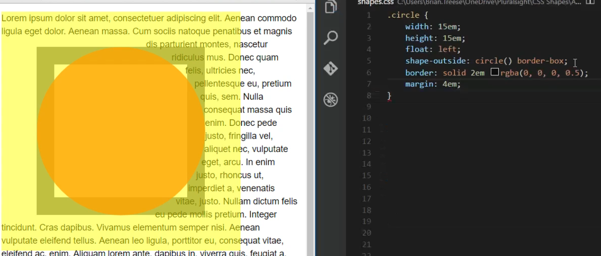
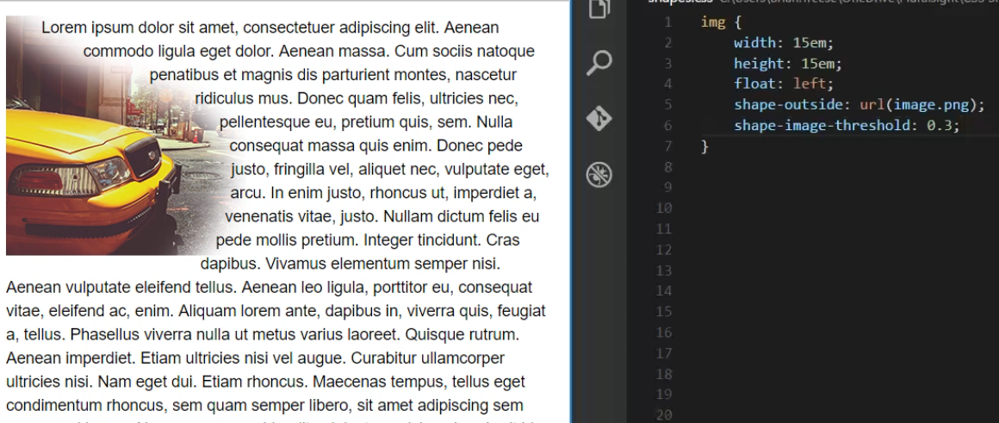
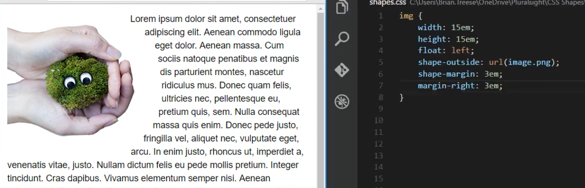

# Web2020 - CSS:  Syllabus  :tada:

#Homework:

Team Treehouse [Design Foundations](https://teamtreehouse.com/library/design-foundations)
Team Treehouse [CSS Transitions and Transforms](https://teamtreehouse.com/library/css-transitions-and-transforms)
(Extra Credit) [CSS Photoshop Foundations](https://teamtreehouse.com/library/photoshop-foundations)

### 01: Flexbox Intro and intro to CSS transitions and animations.
The instructor introduces how to think in flexbox terms and the interplay between the flex-direction, align-items and justify-content. In addition, students are shown how to override these properties from the children element (by using align-self) and relative sizing of flex elements by using the flex-grow property. Class assignment is to implement the mockup in the 01-flexbox folder.

During the second half of the class we start a discussion on css transitions and transforms following the [front end masters course](https://frontendmasters.com/courses/motion-design-css/#v=kg4ru7ne8g&p=0.5565)

The day's goal is to finish the exercise with the cat and the ball.

### 02: CSS Animations
Following the front end masters course, we implement the cat walking animation and we have him move through the screen. We also do the wag the cat exercise and the first part of the alice in wonderland exercise.

### 03: CSS Animation Project
Students are tasked with creating their own css animation projects with a parallax background and using any of the assets in the 03-Animation-Assets folder.

### 04: Finish CSS animation project and start Firebase
We will build a firebase chat engine using the designs from [this ui kit](https://www.invisionapp.com/chat#!). After this day, the bare bones chat functionality and oauth login should be finished, as in [this repo](https://github.com/FVITech/firechat).

### 05-06: Finish Firebase Project
We finish the firebase project and on the bottom part of day 6 we have a flexbox test.

### 07-08: CSS to SASS
Follow team treehouse CSS to SASS course, up until the variables section. The goal of these two days is to convert the firebase project into SASS.

### 09 More practice with Flexbox via Bootstrap 4
Implement [this UI design](07_BootStrap4/Pencil_and_Co/design.png) using flexbox only.

Also implement this [wireframe](07_BootStrap4\FullStack_Conference\img)

### 10: CSS Gradients, CSS Shapes and final project
We implement double gradient techniques in constructing the Lake Tahoe Page from the 08-Lake-Tahoe folder. We use [CSS tricks](https://css-tricks.com/css3-gradients/) for a quick refresher on gradient syntax. We also start the quiz-app final project.

We also discuss CSS shapes according to the pluralsight class [Thinking Outside the Box with CSS Shapes](https://app.pluralsight.com/player?course=css-shapes-thinking-outside-box&author=brian-treese&name=css-shapes-thinking-outside-box-m2&clip=5&mode=live). In particular, we focus on the shape-outside property, the clip property, and the shape sizing parameters margin-box, border-box, padding-box, and content-box.

We also discuss how to use images with transparent background as CSS shapes with the shapeurl property and how to adjust the distance the text has from the shape with the shape-margin property.

### 11: Finish Quiz app

### 12: Final exam
