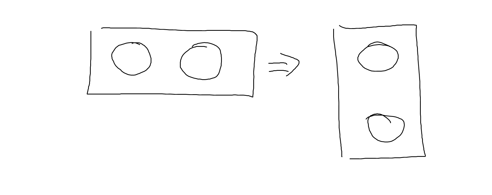

#Final exam
##Question 1

Create a responsive layout with two circles directly inside the body of your html. You must use flexbox. **Do not use media queries.**

The circles should stack on top of one another on screen sizes lower than 400px, as in the picture:

**Publish your solution to fvi-grad.com under the following url: yourname.fvi-grad.com/web2020/test2. Failure to do this will result in no credit**

#Question 2

Finish the chat layout and the layout for the website you're working on.

##Question 3 (optional)

Convert your personal website to SASS and convert your portfolio section to a similar format to that presented in question 1 (responsive flexbox with no media queries).

Use one of the following pens to animate your portfolio items:

http://codepen.io/SaraSoueidan/pen/zsgit

http://codepen.io/dmitrymin/pen/wBVbLM

http://codepen.io/honglio/pen/FKyxG (choose 1)

http://codepen.io/noeldelgado/pen/pGwFx (hard)
